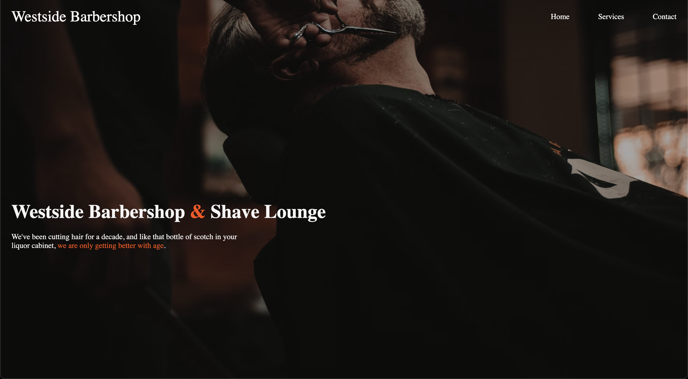

# < barber-shop >

<fig>

<figcaption>The home page of the barber-shop website</figcaption>
</fig>

# < barber-shop >

## introduction

> This project is the first I built for the Front-End Arretado 🌵 initiative.
> It is a barbershop website where clients are able to see what the barbershop offers and to schedule an appointment with the barber place.

This website was built with the intension of showing my skils with HTML, CSS and JS.

## Technical Analysis

The system is composed by a web interface built with HTML, CSS and JS. Main Features:

- **F1** - Home page -> Talks a little bit about the barbershop and gives a bit of information about the services and availability they have during the week.
- **F2** - Services page -> Talks about the services that the barbershop offers and let the customer know about the prices of them.
- **F3** - Contact page -> Let the costumer leave their information and schedule an appointment with the barbershop place.

The tools used to build this system was HTML,the most basic building block of the Web. It defines the meaning and structure of web content. Also, CSS: used to describe a web page's appearance/presentation. And, finally, JavaScript: used to describe a web page's functionality/behavior

### Requirements Gathering

Os requisitos devem ser validados com a cliente e aprovados.
The client asked to use a website that already existed on the internet and rebuild it using only HTML/CSS/JS

### Functional Requirements

Respecting what was proposed, the system will attend the following requisites

- **RF1** - Code Legibility.
- **RF2** - Only HTML/CSS/JS.
- **RF3** - Commits.

## Basic concepts

- [JavaScript](https://developer.mozilla.org/en-US/docs/Web/JavaScript)
- [CSS](https://www.w3schools.com/css/)
- [HTML](https://www.w3schools.com/html/)
- [Git](https://git-scm.com/)
